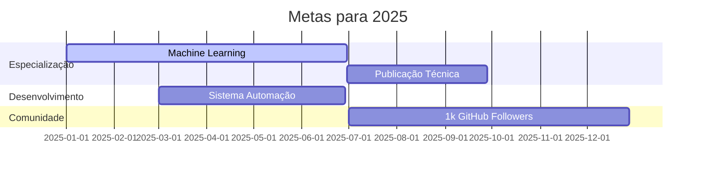

  

    
    <h1 style="margin: 0 0 8px 0; color: #2c3e50; font-size: 2.2rem;">Delbler Ferreira Amancio</h1>
    

      <em>Engenheiro Multidisciplinar | Desenvolvedor Full-Stack | Especialista em Automação</em>
    

  

## 🚀 Portfólio Profissional

---

### 👨‍💻 Perfil Técnico

  

    <h3 style="margin-top: 0; color: #2c3e50;">Formação Acadêmica</h3>
    <ul style="padding-left: 20px;">
      <li>Engenharia de Software</li>
      <li>aria dearia de Produção</li>
      <li>Engenharia Mecânica</li>
    </ul>
  

  
  

    <h3 style="margin-top: 0; color: #2c3e50;">Especializações</h3>
    <ul style="padding-left: 20px;">
      <li>Automação de Processos</li>
      <li>Análise de Dados</li>
      <li>Soluções Tech-Driven</li>
    </ul>
  

---

### 🛠️ Stack Tecnológico Completo

**Linguagens & Frameworks**  

**Ferramentas & Plataformas**  

**Cloud & Databases**  

---

### 📌 Projetos em Destaque

  <h3 style="margin-top: 0; color: #2c3e50;">Projetos Notáveis</h3>
  <ul>
    <li><strong>Sistema de Automação Empresarial</strong> - Python, Flask, MySQL</li>
    <li><strong>Plataforma de Análise de Dados</strong> - Pandas, Matplotlib, Streamlit</li>
    <li><strong>Aplicativo Web para Gestão Financeira</strong> - React, Node.js, MongoDB</li>
  </ul>

---

### 📈 Estatísticas de Desenvolvimento

---

### 🌐 Contato Profissional

---

### 🎯 Roadmap Profissional 2025

---

### 📚 Guia de Estudos

🔍 Expandir Plano de Aprendizado

**Rotina Diária de Estudos**  
| Horário | Atividade | Recursos |
|---------|-----------|----------|
| 08:00-09:00 | Leitura Técnica | Artigos científicos, documentação |
| 14:00-16:00 | Prática de Codificação | LeetCode, projetos pessoais |
| 19:00-19:30 | Revisão de Algoritmos | "Introduction to Algorithms" |

**Recursos Recomendados**  
- 📚 Livro: "Clean Code" de Robert C. Martin  
- 🎓 Curso: CS50's Introduction to Computer Science (Harvard)  
- 📰 Newsletter: Towards Data Science  
- 🎥 Canal: Fireship.io (conceitos avançados em 100 segundos)

---

> *"Na intersecção estratégica entre engenharia e tecnologia, construo soluções que transformam dados em decisões e ideias em realidade."*  
> **Delbler Ferreira Amancio**  
> 
🚀

