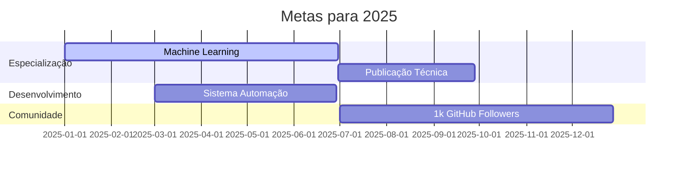

<div style="display: flex; justify-content: center; align-items: center; gap: 30px; min-height: 100vh; flex-wrap: wrap; text-align: center;">

  <!-- Imagem de perfil -->
  

  <!-- Letreiros -->
  <div style="display: flex; flex-direction: column; gap: 20px;">
    
    
  </div>

</div>

<hr>

<h2 style="text-align: center;">🚀 Portfólio Profissional</h2>
<hr>🚀 Portfólio Profissional</h2>
<hr>

<div style="display: flex; flex-wrap: wrap; gap: 20px; margin-top: 20px; font-family: Arial, sans-serif; color: #2c3e50; justify-content: flex-start;">

  <div style="flex: 1; min-width: 280px; background: #f0f8ff; padding: 20px; border-radius: 10px; border-left: 5px solid #4A90E2; box-shadow: 0 2px 8px rgba(0,0,0,0.1); text-align: left;">
    <h3 style="margin-top: 0; display: flex; align-items: center; gap: 8px; justify-content: flex-start;">
      <span>🎓</span> Formação Acadêmica
    </h3>
    <ul style="list-style: none; padding-left: 0;">
      <li style="margin-bottom: 10px; text-align: left;">👨‍💻 Engenharia de Software <em>(em Formação)</em></li>
      <li style="margin-bottom: 10px; text-align: left;">🏭 Engenharia de Produção <em>(em Formação)</em></li>
      <li style="text-align: left;">⚙️ Engenharia Mecânica <em>(em Formação)</em></li>
    </ul>
  </div>

  <div style="flex: 1; min-width: 280px; background: #f0f8ff; padding: 20px; border-radius: 10px; border-left: 5px solid #4A90E2; box-shadow: 0 2px 8px rgba(0,0,0,0.1); text-align: left;">
    <h3 style="margin-top: 0; display: flex; align-items: center; gap: 8px; justify-content: flex-start;">
      <span>💼</span> Experiência & Foco
    </h3>
    <ul style="list-style: none; padding-left: 0;">
      <li style="margin-bottom: 10px; text-align: left;">📊 Administrador de Finanças Freelance</li>
      <li style="text-align: left;">💡 Foco em: Automação de Processos, Análise de Dados, Soluções Tech-Driven</li>
    </ul>
  </div>

  <div style="flex: 1; min-width: 280px; background: #f0f8ff; padding: 20px; border-radius: 10px; border-left: 5px solid #4A90E2; box-shadow: 0 2px 8px rgba(0,0,0,0.1); text-align: left;">
    <h3 style="margin-top: 0; display: flex; align-items: center; gap: 8px; justify-content: flex-start;">
      <span>🌱</span> Aprendizado Atual
    </h3>
    <ul style="list-style: none; padding-left: 0;">
      <li style="margin-bottom: 10px; text-align: left;">🌐 Web Development</li>
      <li style="margin-bottom: 10px; text-align: left;">🐍 Python Avançado</li>
      <li style="text-align: left;">🤖 Machine Learning</li>
    </ul>
  </div>

</div>

<hr>

<h3 style="text-align: left;">🛠️ Stack Tecnológico Completo</h3>

<div style="display: grid; grid-template-columns: repeat(auto-fit, minmax(200px, 1fr)); gap: 12px; margin: 25px 0; text-align: left;">

  <div>
    <strong>Linguagens & Frameworks</strong><br>
    
    
    
    
    
  </div>

  <div>
    <strong>Ferramentas & Plataformas</strong><br>
    
    
    
    
  </div>

  <div>
    <strong>Cloud & Databases</strong><br>
    
    
    
  </div>

</div>

<hr>

### 📌 Projetos em Destaque

<div style="display: flex; flex-wrap: wrap; gap: 20px; justify-content: center; margin: 30px 0;">

[](https://git.io/streak-stats)

<div style="background: #f8f9fa; padding: 15px; border-radius: 10px; width: 100%;">
  <h3 style="margin-top: 0; color: #2c3e50;">Projetos Notáveis</h3>
  <ul>
    <li><strong>Sistema de Automação Empresarial</strong> - Python, Flask, MySQL</li>
    <li><strong>Plataforma de Análise de Dados</strong> - Pandas, Matplotlib, Streamlit</li>
    <li><strong>Aplicativo Web para Gestão Financeira</strong> - React, Node.js, MongoDB</li>
  </ul>
</div>

</div>

---

### 📈 Estatísticas de Desenvolvimento

<div align="center" style="display: flex; flex-wrap: wrap; justify-content: center; gap: 20px; margin: 30px 0;">


</div>

---

### 🌐 Contato Profissional

<div align="center" style="display: flex; flex-wrap: wrap; justify-content: center; gap: 12px; margin: 30px 0;">

[](https://www.linkedin.com/in/delbler-ferreira-consultor)
[](https://www.instagram.com/delbler_ferreira)
[](https://medium.com/@delblerferreira9)
[](mailto:delblerferreira9@gmail.com)
[](https://beacons.ai/delblerferreira)
[](https://github.com/delblerferreira)

</div>

---

### 🎯 Roadmap Profissional 2025



---

<details>
<summary>📚 Guia de Estudos (Clique para Expandir)</summary>

<table>
  <thead>
    <tr>
      <th style="background-color:#4A90E2; color:white; padding:8px; border:1px solid #4A90E2;">Assunto</th>
      <th style="background-color:#4A90E2; color:white; padding:8px; border:1px solid #4A90E2;">Tempo (h)</th>
      <th style="background-color:#4A90E2; color:white; padding:8px; border:1px solid #4A90E2;">Período</th>
      <th style="background-color:#4A90E2; color:white; padding:8px; border:1px solid #4A90E2;">Status</th>
    </tr>
  </thead>
  <tbody>
    <tr>
      <td style="border:1px solid #4A90E2; padding:8px;">Leitura Técnica</td>
      <td style="border:1px solid #4A90E2; padding:8px;">1h</td>
      <td style="border:1px solid #4A90E2; padding:8px;">02/2025 a 05/2025</td>
      <td style="border:1px solid #4A90E2; padding:8px; background-color:#5bc0de; color:white;">Concluido</td>
    </tr>
    <tr>
      <td style="border:1px solid #4A90E2; padding:8px;">Prática de Codificação</td>
      <td style="border:1px solid #4A90E2; padding:8px;">2h</td>
      <td style="border:1px solid #4A90E2; padding:8px;">02/2025 a 12/2025</td>
      <td style="border:1px solid #4A90E2; padding:8px; background-color:#5bc0de; color:white;">Em Andamento</td>
    </tr>
    <tr>
      <td style="border:1px solid #4A90E2; padding:8px;">Revisão de Algoritmos</td>
      <td style="border:1px solid #4A90E2; padding:8px;">30min</td>
      <td style="border:1px solid #4A90E2; padding:8px;">02/2025 a 10/2025</td>
      <td style="border:1px solid #4A90E2; padding:8px; background-color:#5bc0de; color:white;">Em Andamento</td>
    </tr>
  </tbody>
</table>

---

### 📊 Andamento do Estudo (Gráfico Customizado)

```mermaid
gantt
    title Progresso dos Estudos
    dateFormat  YYYY-MM-DD
    axisFormat  %m/%Y
    section Leitura Técnica
    Concluido           :active,    lt, 2025-02-01, 2025-05-31
    section Prática de Codificação
    Em Andamento           :active,    pc, 2025-02-01, 2025-12-31
    section Revisão de Algoritmos
    Em Andamento           :active,    ra, 2025-02-01, 2025-10-31

